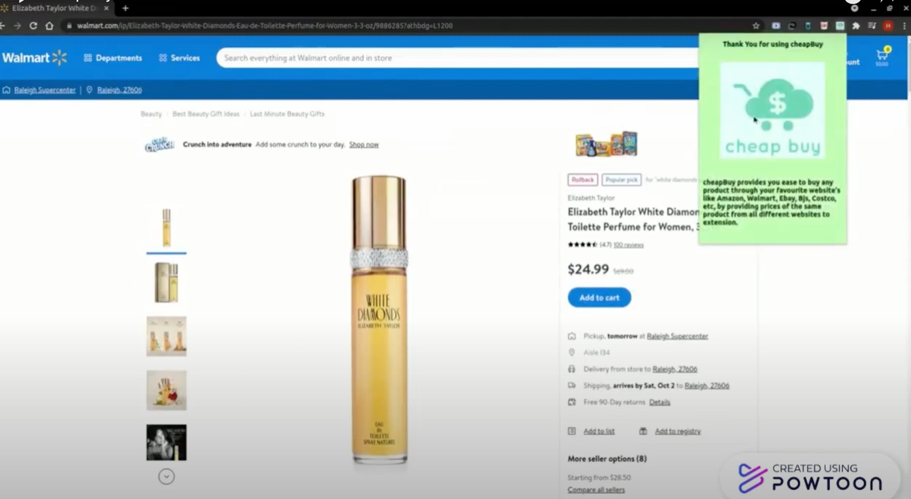
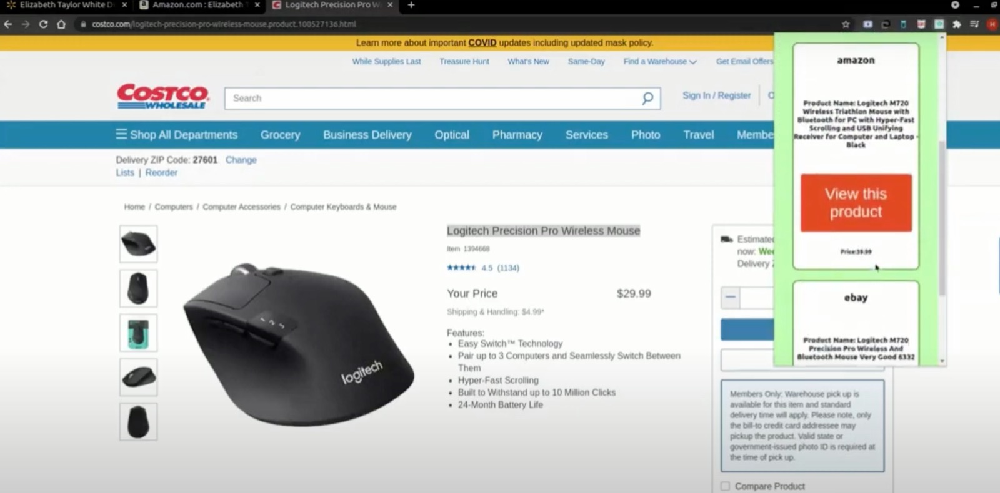

  

 
 
We have displayed the use cases in the videos of the products in different e-commerce websites.
 
 

  

This is the display of the AWS server.
 
 

  

  

We searched white diamonds perfume in walmart and using the extension cheapBuy we got comparison in amazon.
 
 

  

  

We even searched for logitech mouse on Bjs and got comparable prices on amazon and Ebay.
